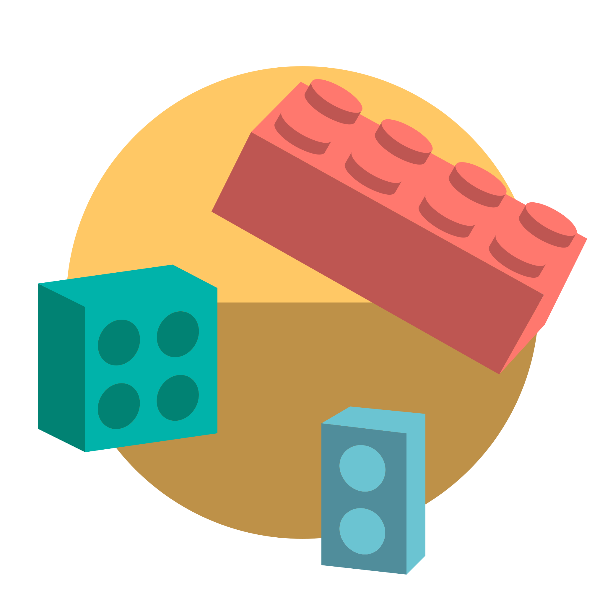

<!-- PROJECT LOGO -->
 

    

  <h1 align="center">Guardian-bot</h1>

  <h3 align="center">
    <i>The Goal is to Protect</i>
     
     
    <a href="https://github.com/Saup21/Guardian-bot/">View Demo</a>
    ·
    <a href="https://github.com/Saup21/Guardian-bot/issues">Report Bug</a>
    ·
    <a href="https://github.com/Saup21/Guardian-bot/issues">Request Feature</a>
    <!-- .
    <a href="https://github.com/amanjha8100/chords/blob/main/doc/deploy.md">Deploy Walkthrough</a> -->
  </h3>

<!-- TABLE OF CONTENTS -->

  
Table of Contents

  <ol>
    <li>
      <a href="#about-the-project">About The Project</a>
      <ul>
        <li><a href="#built-with">Built With</a></li>
      </ul>
    </li>
    <li>
      <a href="#getting-started">Getting Started</a>
      <ul>
        <li><a href="#prerequisites">Prerequisites</a></li>
        <li><a href="#installation">Installation</a></li>
      </ul>
    </li>
    <li><a href="#available-bot-commands">Bot Commands</a></li>
    <li><a href="#configuration---discord-developer-portal">Configuration - Discord Developer Portal</a></li>
    <li><a href="#roadmap">Roadmap</a></li>
    <li><a href="#contributing">Contributing</a></li>
    <li><a href="#license">License</a></li>
  </ol>

<!-- ABOUT THE PROJECT -->

## About The Project

A lot of phishing and spam urls are getting circulated these days. Those who are falling for the so called free gifts are ending up compromising their accounts.\
So I thought of making the *Guardian-bot* for our Discord Community.

### Built With

- [Typescript](https://www.typescriptlang.org/)
- [discord.js](https://discord.js.org/#/docs/discord.js/stable/general/welcome)
- [axios](https://www.npmjs.com/package/axios)
- [ipqualityscore.com](https://www.ipqualityscore.com/)

<!-- GETTING STARTED -->

## Getting Started

To get a local copy up and running follow these simple steps.

### Prerequisites

  **You should have Javascript and  installed in your system if not then don't worry the installation file will get you everything if you are using a windows machine**
- Active internet connection through out installation (Must)
- Python3   (Must for Other Users)
- FFmpeg    (Must for Other Users)
