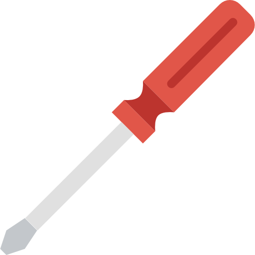

<!-- PROJECT LOGO -->
<br />
<p align="center">
    

  <h1 align="center">Guardian-bot</h1>

  <h3 align="center">
    <i>The Goal is to Protect</i>
    <br />
    <br />
    <a href="https://github.com/Saup21/Guardian-bot/">View Demo</a>
    ·
    <a href="https://github.com/Saup21/Guardian-bot/issues">Report Bug</a>
    ·
    <a href="https://github.com/Saup21/Guardian-bot/issues">Request Feature</a>
    <!-- .
    <a href="https://github.com/amanjha8100/chords/blob/main/doc/deploy.md">Deploy Walkthrough</a> -->
  </h3>
</p>

<!-- TABLE OF CONTENTS -->
<details open="open">
  <summary>Table of Contents</summary>
  <ol>
    <li>
      <a href="#about-the-project">About The Project</a>
      <ul>
        <li><a href="#built-with">Built With</a></li>
      </ul>
    </li>
    <li>
      <a href="#getting-started">Getting Started</a>
      <ul>
        <li><a href="#prerequisites">Prerequisites</a></li>
        <li><a href="#installation">Installation</a></li>
      </ul>
    </li>
    <li><a href="#available-bot-commands">Bot Commands</a></li>
    <li><a href="#configuration---discord-developer-portal">Configuration - Discord Developer Portal</a></li>
    <li><a href="#roadmap">Roadmap</a></li>
    <li><a href="#contributing">Contributing</a></li>
    <li><a href="#license">License</a></li>
  </ol>
</details>

<!-- ABOUT THE PROJECT -->


## About The Project

A lot of phishing and spam urls are getting circulated these days. Those who are falling for the so called free gifts are ending up compromising their accounts.\
So I thought of making the *Guardian-bot* for our Discord Community.



### Built With

- [Typescript](https://www.typescriptlang.org/)
- [discord.js](https://discord.js.org/#/docs/discord.js/stable/general/welcome)
- [axios](https://www.npmjs.com/package/axios)
- [ipqualityscore.com](https://www.ipqualityscore.com/)

<!-- GETTING STARTED -->


## Getting Started

To get a local copy up and running follow these simple steps.


### Prerequisites

  **You should have Javascript and  Typescript installed in your system. If not then don't worry the installation section has all the steps that you are going to need.**
- Active internet connection through out installation (Must)
- Account in [ipqualityscore.com](https://www.ipqualityscore.com/) (Must for Other Users)
- Javascript (Must for Other Users)
- Typescript (Must for Other Users)


### Installation for Windows users

1. Fork the project.
2. Clone the forked repository.
    ```sh
    git clone https://github.com/<your_username>/Guardian-bot.git
    ```
3. Move to the directory.
    ```sh
    cd Guardian-bot
    ```
4. Create a Bot from the Discord Developer Portal and copy the Bot token. Create a `.env` file in the root directory and paste the Token.
    ```sh
    TOKEN = "Your Token"
    ```
5. Create an account at [ipqualityscore.com](https://www.ipqualityscore.com/) and go to [Malicious URL Scanner API Documentation](https://www.ipqualityscore.com/documentation/malicious-url-scanner-api/overview)
6. Copy the API PRIVATE KEY and paste it in the `.env` file as: 
    ```sh
    PRIV_KEY = "Your Private Key"
    ```
7. Copy the API URL and paste it in the `.env` file as: 
    ```sh
    API_URL="API URL FOR IPQUALITYSCORE.COM"
    ```
8. Install Typescript and ts-node globally
    ```sh
    npm i -g typescript ts-node
    ```
9. Install all the packages
    ```sh
    npm i
    ```
10. Invite the Bot to your server and run
  - To run in dev mode 
    ```sh
    npm run dev
    ```


### Installation for Linux users

1. Fork the project.
2. Clone the forked repository.
    ```sh
    git clone https://github.com/<your_username>/Guardian-bot.git
    ```
3. Move to the directory.
    ```sh
    cd Guardian-bot/
    ```
4. Create a Bot from the Discord Developer Portal and copy the Bot token. Create a `.env` file in the root directory and paste the Token.
    ```sh
    TOKEN = "Your Token"
    ```
5. Create an account at [ipqualityscore.com](https://www.ipqualityscore.com/) and go to [Malicious URL Scanner API Documentation](https://www.ipqualityscore.com/documentation/malicious-url-scanner-api/overview)
6. Copy the API PRIVATE KEY and paste it in the `.env` file as: 
    ```sh
    PRIV_KEY = "Your Private Key"
    ```
7. Copy the API URL and paste it in the `.env` file as: 
    ```sh
    API_URL="API URL FOR IPQUALITYSCORE.COM"
    ```
8. Install Typescript and ts-node globally
    ```sh
    npm i -g typescript ts-node
    ```
9. Install all the packages
    ```sh
    npm i
    ```
10. Invite the Bot to your server and run
  - To run in dev mode 
    ```sh
    npm run dev
    ```

<!-- CONFIGURATION - DISCORD DEVELOPER PORTAL -->


## Configuration - Discord Developer Portal

Go to the [Discord Developer Portal](https://discord.com/developers/docs/intro) to create your application and bot. You must give the following permissions:

- Admin Intent ✔️
